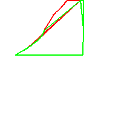

# shape-to-png-poc

Sample node module demonstrating how to take a nation-wide alerts shape and dbf file, filter it down to a given reporter and alert types, and draw polygons.

Sample shape and dbf files, as well as the resulting image are included. The live shape file should be fetched from: http://www.srh.noaa.gov/ridge2/shapefiles/

